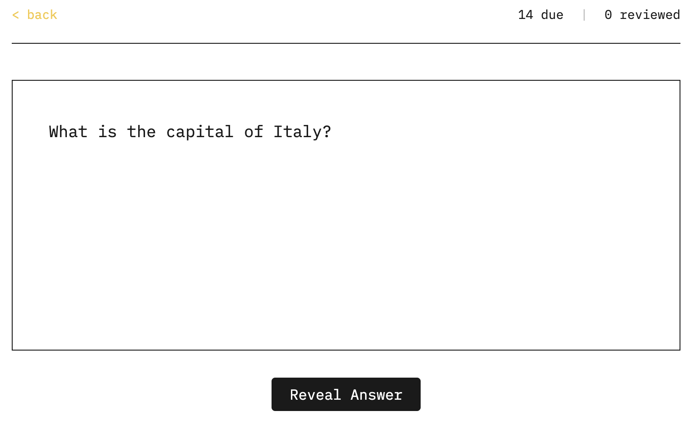

# Flashcards

An in-browser spaced-repetition system.



Review what's important to you and outsmart the forgetting curve.

## Getting started

### Prerequisites

- Node.js (v14 or higher)
- npm

### Creating flashcards

#### Card format
Flashcards are written in markdown files using a Q:/A: or C: format.

**Question/Answer Cards:**
```markdown
Q: What is the capital of France?
A: Paris.
```

**Cloze Deletion Cards:**
```markdown
C: [Paris] is the capital of France.
```

Each `[text]` in a cloze card creates a separate card where that text is hidden.

**Supported Features:**
- **Multiline content** - Questions and answers can span multiple lines
- **LaTeX math** - Use `$inline math$` or `$$display math$$` for equations
- **Images** - Embed with ``
- **Audio** - Embed with ``

#### File Structure

Organize your flashcards in `public/collection/` with the following structure:

```
public/collection/
├── my-deck/
│   └── flashcards/
│       ├── topic1.md
│       └── topic2.md
└── another-deck/
    └── flashcards/
        └── cards.md
```

Each directory in `public/collection/` becomes a separate deck. Place your markdown files in the `flashcards/` subdirectory.

### Installation

**1. Install dependencies:**
```bash
npm install
```

**2. Build the collection index:**
```bash
npm run process-submodules
```

This scans `public/collection/` and generates an index of all your flashcard decks.

**3. Run the app:**
```bash
npm run dev
```

Open your browser to http://localhost:3000.

### ⚠️ Important

When running locally without GitHub authentication, your review progress is stored in **localStorage only**. This means:

- Progress is saved locally in your browser
- Your Free Spaced Repitition Scheduler (FSRS) will be lost if you clear browser data
- No cross-device sync

## Prior Work
- [hashcards](https://github.com/eudoxia0/hashcards?tab=readme-ov-file)

## License
© 2025 by [Thomas Ribeiro](https://thomasrribeiro.github.io/). Licensed under the [Apache 2.0](https://www.apache.org/licenses/LICENSE-2.0) license.