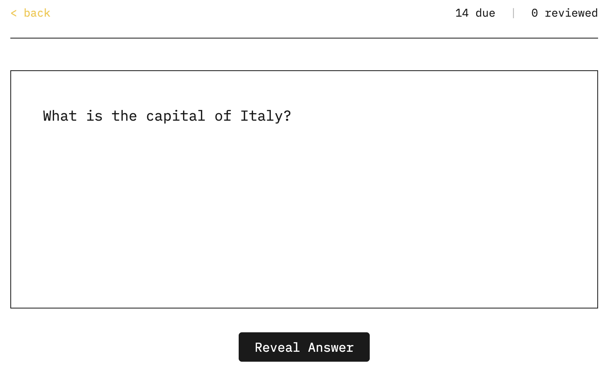

# Flashcards

An in-browser spaced-repetition system and a standards-driven CLI for building
durable flashcard decks.

**Live app:** https://thomasrribeiro.com/flashcards/



## Run the application

Requirements: Node.js 20 or newer and npm.

```bash
npm install
npm run dev
```

The production build is created with:

```bash
npm run build
```

When signed out, review state remains in browser storage. Signed-in users can
sync supported study state across devices.

## Install the CLI

From this repository:

```bash
npm install
npm link
flashcards doctor
```

The CLI deliberately separates deterministic operations from agent judgment:

- scaffolding, stable IDs, parsing, math, metadata, and asset checks are local
  deterministic commands;
- curriculum research, card writing, figures, and semantic audits use Codex and
  the versioned `$manage-flashcard-decks` skill in `.agents/skills/`.

Codex runs with the deck as its primary writable workspace and the subject
directory as an additional workspace. The application repository is supplied
as read-only standards and parser context.

Normal local use relies on `codex login`; the CLI does not request, store, or
forward an API key. API-key authentication is only necessary if you separately
choose to run Codex in unattended automation.

## Create a subject and deck

Subjects and decks use lowercase kebab-case. By default, decks are created at
`~/notes/<subject>/<deck>/`; override this with `--notes-root` or the
`FLASHCARDS_NOTES_ROOT` environment variable.

```bash
flashcards subject create biology

flashcards deck create biology genetics \
  --description "Mechanistic genetics from inheritance to gene regulation"

flashcards deck build ~/notes/biology/genetics
```

Create a scaffold and immediately open Codex:

```bash
flashcards deck create biology genetics --agent
```

Create initial ordered chapters when the curriculum is already known:

```bash
flashcards deck create computer-science operating-systems \
  --chapter foundations \
  --chapter processes-and-threads \
  --chapter virtual-memory
```

Each deck is initialized as its own Git repository on `master` unless
`--no-git` is supplied. The scaffold includes:

```text
deck-name/
├── .flashcards/audits/
├── figures/
├── flashcards/
├── references/              # local source material; contents gitignored
├── AGENTS.md
├── CARD_README.md
├── README.md
└── deck.toml
```

The subject directory also receives `AGENTS.md`, `ROADMAP.md`, and
`SUBJECT_BRIEF.md` when they are missing. Existing files are never
overwritten.

## Maintain a deck

```bash
# Add the next ordered chapter and matching figures directory
flashcards deck add-chapter ~/notes/biology/genetics gene-regulation

# Add stable IDs before revising studied legacy cards
flashcards deck stabilize ~/notes/biology/genetics

# Validate IDs, parser output, frontmatter, KaTeX, clozes, and image paths
flashcards deck validate ~/notes/biology/genetics

# Save the complete machine-readable inventory
flashcards deck validate ~/notes/biology/genetics \
  --out ~/notes/biology/genetics/.flashcards/validation.json
```

## Build and audit with Codex

Interactive sessions are the default because curriculum and correctness work
benefits from visible judgment and feedback.

```bash
flashcards deck build ~/notes/biology/genetics
flashcards deck audit ~/notes/physics/mechanics
```

Inspect the exact ordered Markdown context before launching an agent:

```bash
flashcards deck context ~/notes/biology/genetics --mode build
flashcards deck context ~/notes/physics/mechanics --mode audit --json
```

The command reports every present file, its role and word count, optional
missing files, and the total context. Build and audit prompts use the same
manifest, so documentation drift is visible instead of implicit.

Before any editing agent starts, the CLI gives existing card blocks stable IDs
so later wording, figure, and correctness improvements cannot silently discard
their schedules.

`deck audit` writes a preflight inventory, loads the universal and
domain-specific standards, and asks Codex to audit and improve the entire deck
chapter by chapter. It validates again after Codex returns. Codex is explicitly
told not to commit or push.

Useful variants:

```bash
# Inspect without editing
flashcards deck audit ~/notes/physics/mechanics --report-only

# Run headlessly through codex exec
flashcards deck audit ~/notes/physics/mechanics --non-interactive

# Inspect the exact invocation and prompt
flashcards deck audit ~/notes/physics/mechanics --dry-run

# Add a temporary objective without changing durable standards
flashcards deck audit ~/notes/physics/mechanics \
  --instructions "Prioritize prerequisite gaps and graph interpretation"

# Explicitly proceed when the deck already has unrelated local changes
flashcards deck audit ~/notes/physics/mechanics --allow-dirty
```

The CLI does not pin a model. It uses the model configured in Codex so future
audits can benefit from stronger models. Use `--model` only for an intentional
one-run override.

## Stable card identity

Every new card block should carry a repository-scoped stable ID:

```markdown
<!-- card-id: card-018f6c2a-7b1e-7000-8000-123456789abc -->
Q: Which forces act on a block resting on a level table?
A: Its weight and the table's normal force.
```

Preserve the ID for corrections, clearer wording, formatting, accessibility,
or figures when the retrieval target remains the same. Assign a new ID when the
learner must retrieve materially different knowledge. Keep generated
`card-alias` comments so devices can migrate legacy content-hash schedules.

## Card format

Canonical files use TOML frontmatter and ordered `NN_snake_case.md` filenames:

```markdown
+++
order = 1
subject = "physics"
tags = ["mechanics"]
+++

<!-- card-id: card-... -->
Q: Why can acceleration be nonzero while speed is constant?
A: Acceleration measures change in the velocity vector, including direction.

<!-- card-id: card-... -->
C: The slope of a position-time graph is [velocity].

<!-- card-id: card-... -->
P: A symbolic problem statement with all required givens.
S: A transferable solution method with a genuine evaluation step.
```

Read these sources of truth before authoring manually:

- `templates/guides/CARD_STANDARD.md`
- `templates/guides/AUTHORING_PLAYBOOK.md`
- the applicable subject guide in `templates/guides/`

The context hierarchy deliberately avoids repetition:

| Document | Responsibility |
|---|---|
| `CARD_STANDARD.md` | Normative card, deck, parser, and identity acceptance rules |
| `AUTHORING_PLAYBOOK.md` | Universal curriculum, learning, source, figure, and audit decisions |
| `templates/guides/<subject>.md` | Reusable domain-specific judgment |
| subject `SUBJECT_BRIEF.md` | Learner, depth, conventions, and evidence authorities |
| subject `ROADMAP.md` | Deck sequence, prerequisites, and durable outcomes |
| deck `README.md` | Scope, chapter map, and source register |
| deck `CARD_README.md` | Deck-specific retrieval design and justified exceptions |

`general.md` and `new-subject.md` remain only as short compatibility pointers
for older links; agents do not load them.

## Development checks

```bash
npm test
npm run build
git diff --check
```

## Prior work

- [hashcards](https://github.com/eudoxia0/hashcards) inspired the plain-text
  card format.

## License

© 2025 Thomas Ribeiro. Licensed under the [Apache License 2.0](LICENSE).
