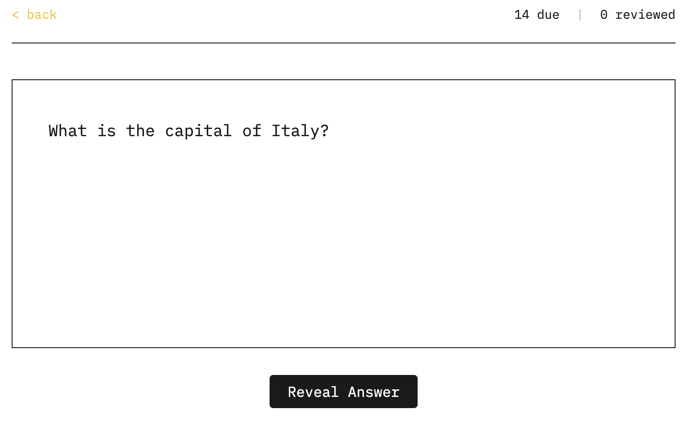

# Flashcards

An in-browser spaced-repetition system and a standards-driven CLI for building
durable flashcard decks.

**Live app:** https://thomasrribeiro.com/flashcards/



## Run the application

Requirements: Node.js 20 or newer and npm.

```bash
npm install
npm run dev
```

The production build is created with:

```bash
npm run build
```

When signed out, review state remains in browser storage. Signed-in users can
sync supported study state across devices.

## Install the CLI

From this repository:

```bash
npm install
npm link
flashcards doctor
```

The CLI separates deterministic operations from agent judgment:

- scaffolding, stable IDs, parsing, math, metadata, and asset checks are local
  deterministic commands;
- curriculum research, card writing, figures, and semantic audits use Codex and
  the versioned `$manage-flashcard-decks` skill in `.agents/skills/`.

By default every judgment-heavy command starts a fresh, non-resumable agent
process in a temporary copy of the target. Only the ordered Markdown context
reported by `subject context` or `deck context`, the target chapter, and its
machine-resolved transitive prerequisite closure are staged. Unrelated chapters
are absent from bounded chapter workspaces. Live web research remains
available. A clean patch is applied back after the agent succeeds, and the
prompt, constrained target snapshot, prerequisite-closure hashes, ordered
context and vendored-skill hashes, provider/model version, result, and patch are
recorded under
`~/.flashcards/runs/`.

Codex runs use `codex exec --ephemeral --ignore-user-config --ignore-rules`,
Claude runs disable session persistence and setting sources, and Gemini runs
with an isolated home directory. They do not resume prior conversations or
persist new ones. Provider platform instructions and the selected model still
come from the provider, while all repository- and learner-specific initial
context is explicit and inspectable. Use `--no-isolated` only when intentionally
opting into the legacy local interactive workspace.

This makes runs input-auditable, not bit-for-bit deterministic: model behavior,
live search results, and upstream web pages can change. The source register and
run manifest make those differences reviewable.

Normal local use may rely on the provider CLI's own login. The website can also
connect a provider API key for unattended generation as described below.

## Create a subject and deck

Subjects and decks use lowercase kebab-case. By default, decks are created at
`~/notes/<subject>/<deck>/`; override this with `--notes-root` or the
`FLASHCARDS_NOTES_ROOT` environment variable.

```bash
flashcards subject create biology

# Explicit alternatives:
flashcards subject create physics --destination whole-field
flashcards subject create mathematics --destination undergraduate-core \
  --deck-granularity course
flashcards subject create physics --destination graduate-core \
  --focus quantum-physics

# Add a later research route without rebuilding the existing curriculum:
flashcards subject extend ~/notes/physics \
  --destination research-specialization \
  --focus quantum-field-theory

flashcards deck create biology genetics \
  --description "Mechanistic genetics from inheritance to gene regulation" \
  --assumed-tool basic-statistics
```

When a prerequisite deck already exists in the same notes collection, declare
it with a repeatable flag such as
`--prerequisite-deck biology/cell-biology`.

Both commands launch a fresh isolated agent by default. `subject create`
researches and completes `SUBJECT_BRIEF.md`, the explanatory `ROADMAP.md`, and
the synchronized executable curriculum in `subject.toml`. The default
destination is `whole-field`, which creates a layered roadmap rather than
treating undergraduate study as a permanent ceiling. Every deck separately
records a learning level and a priority tier. Select `literacy`,
`undergraduate-core`, `graduate-core`, or `research-specialization` for a more
focused route; research specialization requires at least one repeatable
`--focus`. `subject extend` preserves valid existing decks—especially approved
or active ones—while adding a graduate or research route and only the
prerequisite bridges it actually needs. The default deck granularity is
`course`, meaning one coherent repository estimated at 6–14 ordered chapters;
other granularities are `module` and `broad-area`. If the
repository does not already provide a reusable `templates/guides/<subject>.md`,
it also creates a subject-owned `DOMAIN_GUIDE.md`. `deck create` inherits its
declared direct prerequisites from that graph, then researches the deck,
completes its README and card blueprint, and authors only the first novice-first
pilot chapter. Pass `--no-agent` to either command when only the deterministic
scaffold is wanted. Subject generation also receives a generated, inspectable
catalog of the other subject curricula under the same notes root. It may reuse
those capabilities with qualified references such as
`mathematics/linear-algebra` instead of duplicating them inside the new subject.
Before launching the agent, the CLI validates the established external-subject
graph and fails fast if it is already invalid; errors in the target subject
remain repairable. Before applying an isolated result, it also verifies that
the nine-column `ROADMAP.md` deck table is synchronized with `subject.toml`.

For isolated extensions, preservation is a checked postcondition before any
generated files are copied back: existing ids, levels, statuses, and hard
prerequisite edges cannot silently disappear or change.

When a proposed deck is later created, `deck create` inherits its hard
prerequisites, learning level, and curriculum order from `subject.toml`.
`--level` is an explicit override, not a default that silently turns graduate
decks into introductory ones. Builds and audits refresh this metadata. To
propagate a roadmap reorder without regenerating cards, run:

```bash
flashcards deck sync-curriculum ~/notes/physics/classical-mechanics
```

`deck build` intentionally authors only the first ordered chapter. The agent
may design the full roadmap, but it must complete a concept-dependency ledger
and `.flashcards/audits/pilot-cold-start.md` before stopping for review. This
prevents a syntactically valid full deck from scaling an incorrect learner
model.

After studying or inspecting the pilot:

```bash
flashcards deck approve-pilot ~/notes/biology/genetics
flashcards deck build ~/notes/biology/genetics --full
```

The full build is rejected unless `deck.toml` records explicit pilot approval.
It must produce `.flashcards/audits/full-cold-start.md` before the CLI marks the
deck built.

Create only the deterministic scaffold:

```bash
flashcards deck create biology genetics --no-agent
```

Create initial ordered chapters when the curriculum is already known:

```bash
flashcards deck create computer-science operating-systems \
  --chapter foundations \
  --chapter processes-and-threads \
  --chapter virtual-memory
```

Each deck is initialized as its own Git repository on `master` unless
`--no-git` is supplied. The scaffold includes:

```text
deck-name/
├── .flashcards/audits/
├── figures/
├── flashcards/
├── references/              # local source material; contents gitignored
├── AGENTS.md
├── CARD_README.md
├── README.md
└── deck.toml
```

The subject directory also receives `AGENTS.md`, `ROADMAP.md`,
`SUBJECT_BRIEF.md`, and `subject.toml` when they are missing. Existing files are
never overwritten by deterministic scaffolding; the isolated subject agent may
subsequently complete or update the curriculum files.

Inspect or validate the AI-authored curriculum graph:

```bash
flashcards subject prerequisites ~/notes/biology
flashcards subject prerequisites ~/notes/biology --deck molecular-biology
flashcards subject validate ~/notes/biology

# Validate and inspect every subject as one cross-subject DAG
flashcards curriculum validate ~/notes
flashcards curriculum audit ~/notes

# Emit a machine-readable index for applications and analysis
flashcards curriculum build ~/notes \
  --output ~/notes/.flashcards/curriculum.json

# Materialize a planned deck by canonical id, synchronize its roadmap
# metadata, and run the usual isolated pilot build.
flashcards curriculum materialize physics/measurement-and-physical-reasoning
```

Schema-v3 subject curricula distinguish destination and focus from each deck's
learning level and priority tier. They separate hard `prerequisites` from
`recommended_after` sequencing, estimate chapter scope, and map every material
field domain to an included deck or deliberate deferral. Local references use
`deck-id`; cross-subject references use `subject/deck-id`. Deck orders must be
topological within a subject, and `curriculum validate` checks the entire
collection as one DAG. Cycles, missing or redundant references, later-level hard edges,
duplicate ids/orders, out-of-range deck estimates, and incomplete coverage are
rejected. `subject validate` additionally rejects missing or drifted roadmap
deck rows, including omitted chapter estimates or mismatched prerequisites.
When a declared deck is created, its hard and recommended direct
edges are copied into `deck.toml`; recommended sequencing is retained for UI
guidance but never grants assumed
knowledge. The home viewer lists positive curriculum orders first, then places
unlisted legacy or community decks alphabetically below them. Existing
schema-v1 and schema-v2 subjects remain readable.

Chapter prerequisites can target an exact provider in another deck with
`concept:subject/deck#concept-id`. A schema-v3 curriculum registry index
preserves those exact chapter edges, repository availability, card counts, and
the materialization command used by the PWA's Curriculum view. From that view,
users begin with a subject-level map, zoom into one subject, focus one deck's
ancestor path, or inspect its chapter DAG. They can add the smallest available
prerequisite path to their study scope, copy commands for missing decks, or
submit a generation request while signed in.

Portable registries have a `registry.toml`, subject packages under `subjects/`,
a committed deck-discovery snapshot, and deterministic `dist/curriculum.json`:

```bash
flashcards registry validate /path/to/curricula
flashcards registry build /path/to/curricula
```

The PWA resolves each enabled GitHub registry branch to a commit, caches that
immutable index for offline fallback, and reports ID collisions when multiple
publishers define the same `subject/deck`. Its Sources control adds or disables
public registries without storing their full indexes in localStorage.

Generation requests are deliberately executed outside the browser. A local,
fresh agent run can consume the oldest request with its local CLI account:

```bash
export FLASHCARDS_WORKER_URL=https://flashcards-worker-prod.example.workers.dev
flashcards requests list
flashcards requests run --notes-root ~/notes --registry-root /path/to/curricula
```

Subject-design requests use a versioned workflow contract rather than relying
on user-authored prompt text. The browser records the exact model, reasoning
effort, workflow version and application commit, registry base commit, and SHA-256 of the catalog in
the queued payload. The trusted runner creates its isolated branch from that
commit and refuses the job if the catalog bytes no longer match. For the normal
whole-field workflow, the user only supplies the subject slug and title; focus,
manual deck constraints, and additional instructions are optional exceptions.
An existing subject is automatically audited with stable identities preserved
where their scope remains valid, while an absent subject is created from the
same versioned contract.

Chapter-curriculum requests use the same reproducibility boundary. The runner
loads the subject package from the exact queued registry commit and supplies a
bounded catalog slice containing the target deck, direct prerequisite chapter
capabilities, compact transitive prerequisites, and direct or recommended
downstream consumers. A successful plan updates the registry's deck snapshot
and compiled catalog on a draft pull request. The Agents tab previews that
unmerged catalog; the production DAG changes only after the pull request is
merged.

Agents labels each job as **Subject DAG**, **Deck DAG**, or **Flashcards**.
Use **Review subject DAG** or **Review deck DAG** to open its generated canvas,
switch between the current loaded curriculum and the proposal, and inspect
added/removed/changed nodes and prerequisite edges. Previewing does not apply
changes. **Apply generated DAG** separately confirms and merges the exact
previewed pull-request commit; completed historical jobs remain viewable.
The subject viewer also exposes **Regenerate DAG**. Every website generation
launch, including prerequisite batches, confirms the exact provider, model, and
reasoning effort before queueing; cancelling creates no job. Change defaults
under Settings → AI generation, then restart the launch flow.

In the Curriculum view, select a planned deck and use **Generate pilot
chapter** to enqueue that same isolated deck pipeline. After the pilot passes
human review and is explicitly approved, the action becomes **Generate
remaining chapters**. Generation settings select the provider, exact model,
and reasoning effort for each queued job. Anthropic, OpenAI, and Google Gemini
connections load the models available to that user's API account; local Codex
and custom runners may still use their configured defaults.

API keys entered in Settings are validated against the provider and encrypted
server-side with user- and provider-bound authenticated encryption. The browser,
queued job, run manifest, logs, and Git repository never receive the stored key.
Only a trusted generation runner may atomically claim a job and receive that
job owner's credential for the lifetime of its child process:

```bash
export FLASHCARDS_WORKER_URL=https://flashcards-worker-prod.example.workers.dev
export FLASHCARDS_RUNNER_TOKEN=... # provisioned out of band by the operator
flashcards requests run --notes-root ~/notes --registry-root /path/to/curricula
```

On macOS the CLI also reads a `flashcards-generation-runner` generic-password
item for the current account, so the runner token need not live in shell files.

For a production queue, install the macOS runner as a recurring LaunchAgent
instead of starting the one-shot command manually. It starts at login, checks
the queue every minute, and never stores the runner token or provider keys in
its configuration:

```bash
npm run runner:install -- \
  --worker-url https://flashcards-worker-prod.example.workers.dev \
  --notes-root ~/notes \
  --registry-root /path/to/curricula
npm run runner:status
```

The service runs one request at a time. `launchd` does not overlap another
instance while an agent is active. Installation creates dedicated workflow and
curriculum checkouts under `~/.flashcards/runner/`, so edits in a developer
checkout cannot contaminate a production job. Before claiming work, the runner
pins its workflow checkout to the most recent successful GitHub Pages
deployment; the request provenance guard still verifies the exact commit.
Each curriculum request is authored in a disposable Git worktree, so a failed
draft cannot leave files that block the next request. Subject drafts receive
one bounded repair pass when deterministic subject, roadmap, or global-DAG
validation rejects an otherwise completed agent run.
Output is written to `~/.flashcards/runner/stdout.log` and `stderr.log`;
uninstalling the service leaves those diagnostic logs and checkouts in place.

The runner needs the corresponding provider CLI on `PATH`: Codex CLI for
OpenAI, Claude Code for Anthropic, or Gemini CLI for Google. Consumer chat
subscriptions and API billing are separate.

The built-in runners also keep provider secrets out of model-launched commands:
Codex applies automatic secret-name environment filtering, Claude disables its
shell tool, and Gemini receives an isolated tool allowlist without shell access.
Use dedicated, spend-limited provider keys and rotate or remove them from
Settings whenever their use is no longer needed.

The untrusted local path uses `FLASHCARDS_GITHUB_TOKEN` or the token returned by
`gh auth token` to authenticate the user's queue. Typed jobs cover subject
design, deck pilots, chapter expansion, and audits. Codex is the default local
provider; a custom provider can implement the one-manifest executable protocol
configured through `FLASHCARDS_AGENT_RUNNER`. Provider credentials exist only
in the claimed child-process environment. Chapter-content jobs resolve the deck
repository from the pinned
curriculum registry, create it under the registry's `deck_owner` when absent,
and publish one review pull request for the chapter plus a companion registry
snapshot pull request. Merging both from Agents publishes the cards and keeps
the curriculum DAG's repository, status, card count, model, reasoning effort,
and workflow provenance synchronized. The first chapter remains the pilot;
merging its validated pull request is the explicit approval that unlocks later
chapter jobs.
Subject and chapter-curriculum registry changes
are committed to an isolated branch and opened as a draft pull request. A
successful job is marked `needs-review`; nothing merges or publishes
automatically.

## Maintain a deck

```bash
# Add a chapter with explicit edges and a concept it establishes
flashcards deck add-chapter ~/notes/biology/genetics gene-regulation \
  --prerequisite chapter:02_molecular_inheritance \
  --provides gene-regulation

# Inspect the graph or one chapter's transitive closure
flashcards deck prerequisites ~/notes/biology/genetics
flashcards deck prerequisites ~/notes/biology/genetics --chapter 3

# Upgrade schema-v1 metadata while preserving its effective closure
flashcards deck migrate-prerequisites ~/notes/biology/genetics

# Add stable IDs before revising studied legacy cards
flashcards deck stabilize ~/notes/biology/genetics

# Validate IDs, parser output, frontmatter, KaTeX, clozes, and image paths
flashcards deck validate ~/notes/biology/genetics

# Compile editable TikZ sources under figures/ to portable SVG assets
flashcards deck render-figures ~/notes/physics/mechanics

# Verify committed SVG assets exactly match their TikZ sources
flashcards deck render-figures ~/notes/physics/mechanics --check

# Save the complete machine-readable inventory
flashcards deck validate ~/notes/biology/genetics \
  --out ~/notes/biology/genetics/.flashcards/validation.json
```

TikZ is the default authoring path for new generated technical diagrams, not a
browser dependency. A source such as
`figures/02_vectors/components_grid.tex` compiles to the same-named `.svg`
using LuaLaTeX and `dvisvgm`; the app continues loading ordinary SVG files
without runtime compilation. Each source must declare `flashcards-title` and
`flashcards-desc` comments, which the renderer copies into accessible SVG
metadata. `deck validate` rejects stale generated figures. Install TeX Live
with LuaLaTeX, TikZ, the standalone class, and `dvisvgm` on authoring
machines that maintain decks with technical figures. Use another medium only
when the authentic visual target requires it and document that exception in the
deck's figure ledger.

## Build and audit with Codex

Fresh isolated runs are the default so the same declared inputs can be audited
and reproduced without hidden conversation history.

```bash
flashcards deck build ~/notes/biology/genetics
flashcards deck audit ~/notes/physics/mechanics
```

To compare a genuinely fresh pilot design against an existing chapter without
letting the agent paraphrase the old cards, blank chapter 1 only inside the
temporary sandbox:

```bash
flashcards deck build ~/notes/physics/mechanics --fresh-pilot
```

The original deck snapshot remains hashed in the run record. The resulting
chapter replaces the prior pilot and therefore receives new stable identities;
use this only when intentionally resetting that chapter's review history.

After approving the pilot, build or freshly regenerate one later chapter in a
bounded isolated run:

```bash
flashcards deck approve-pilot ~/notes/physics/mechanics
flashcards deck build ~/notes/physics/mechanics --chapter 2
flashcards deck build ~/notes/physics/mechanics --chapter 2 --fresh-chapter
```

A schema-v2 chapter build may read only scheduled cards in its resolved local
prerequisite closure, plus external decks and tools declared in `deck.toml`.
Earlier order alone does not grant access. Its patch is restricted to the
selected chapter, figures, chapter-boundary audit, and deck README/blueprint;
unrelated chapters are absent from the sandbox. Schema-v1 decks remain
compatible by inferring the former behavior—all earlier ordered chapters—until
they are migrated. Fresh regeneration gives the selected chapter new review
identities and should be used only after preserving any comparison baseline.

New builds follow a novice-first pilot lifecycle:

1. unconfirmed domain knowledge is treated as unseen;
2. the agent authors only the first chapter;
3. every front dependency is mapped to confirmed inbound knowledge or an
   earlier establishment point;
4. `deck approve-pilot` records the maintainer's explicit decision;
5. only then can `deck build --full` author later chapters.

Target-level labels such as “introductory-college” or “calculus-aware” do not
silently grant subject prerequisites. The pilot audit includes words, symbols,
figures, alt text, diagram conventions, and problem contexts—not only formulas.

Inspect the exact ordered context before launching an agent:

```bash
flashcards subject context ~/notes/biology
flashcards deck context ~/notes/biology/genetics --mode build
flashcards deck context ~/notes/biology/genetics --mode build --chapter 3
flashcards deck context ~/notes/physics/mechanics --mode audit --json
flashcards deck build ~/notes/biology/genetics --dry-run
```

The context commands report every declared Markdown file, its role and word
count, optional missing files, the resolved prerequisite graph, and the total
context. `--dry-run` also prints the prompt and resolved model without launching
an agent. Live runs additionally hash every accessible target, prerequisite,
and vendored skill file in the provenance record, so local inputs are visible
instead of implicit.

Before any editing agent starts, the CLI gives existing card blocks stable IDs
so later wording, figure, and correctness improvements cannot silently discard
their schedules.

`deck audit` writes a preflight inventory, loads the universal and
domain-specific standards, and asks Codex to audit and improve the entire deck
chapter by chapter. It validates again after Codex returns. Codex is explicitly
told not to commit or push.

Useful variants:

```bash
# Inspect without editing
flashcards deck audit ~/notes/physics/mechanics --report-only

# Opt into the legacy local interactive workspace
flashcards deck audit ~/notes/physics/mechanics --no-isolated

# Inspect the exact invocation and prompt
flashcards deck audit ~/notes/physics/mechanics --dry-run

# Add a temporary objective without changing durable standards
flashcards deck audit ~/notes/physics/mechanics \
  --instructions "Prioritize prerequisite gaps and graph interpretation"

# Explicitly proceed when the deck already has unrelated local changes
flashcards deck audit ~/notes/physics/mechanics --allow-dirty
```

The CLI does not pin a model in source. An isolated run resolves the model from
`--model`, then `FLASHCARDS_CODEX_MODEL`, then the current Codex configuration,
and records the resolved value in its run manifest. This permits future audits
to benefit from stronger models while preserving the inputs of each past run.
Use `--model` when exact cross-machine reproduction matters.

## Stable card identity

Every new card block should carry a repository-scoped stable ID:

```markdown
<!-- card-id: card-018f6c2a-7b1e-7000-8000-123456789abc -->
Q: Which forces act on a block resting on a level table?
A: Its weight and the table's normal force.
```

Preserve the ID for corrections, clearer wording, formatting, accessibility,
or figures when the retrieval target remains the same. Assign a new ID when the
learner must retrieve materially different knowledge. Keep generated
`card-alias` comments so devices can migrate legacy content-hash schedules.

## Card format

Canonical files use TOML frontmatter and ordered `NN_snake_case.md` filenames:

```markdown
+++
order = 1
subject = "physics"
tags = ["mechanics"]
prerequisites = []
provides = ["one-dimensional-coordinate"]
+++

<!-- card-id: card-... -->
Q: Why can acceleration be nonzero while speed is constant?
A: Acceleration measures change in the velocity vector, including direction.

<!-- card-id: card-... -->
C: The slope of a position-time graph is [velocity].

<!-- card-id: card-... -->
P: A symbolic problem statement with all required givens.
S: A transferable solution method with a genuine evaluation step.
```

Deck-wide edges and confirmed tools live in `deck.toml`:

```toml
[prerequisites]
decks = ["mathematics/algebra", "mathematics/trigonometry"]
assumed_tools = ["introductory-calculus"]
```

Chapter references support `chapter:NN_name`, `concept:kebab-name`,
`deck:subject/deck`, and `tool:kebab-name`. A concept must have exactly one
earlier local provider. Validation rejects missing or ambiguous references,
later-chapter edges, undeclared external dependencies/tools, and cycles.

Read these sources of truth before authoring manually:

- `templates/guides/CARD_STANDARD.md`
- `templates/guides/AUTHORING_PLAYBOOK.md`
- the applicable subject guide in `templates/guides/`

The context hierarchy deliberately avoids repetition:

| Document | Responsibility |
|---|---|
| `CARD_STANDARD.md` | Normative card, deck, parser, and identity acceptance rules |
| `AUTHORING_PLAYBOOK.md` | Universal curriculum, learning, source, figure, and audit decisions |
| `templates/guides/<subject>.md` | Reusable domain-specific judgment |
| subject `DOMAIN_GUIDE.md` | AI-researched domain guide only when no reusable repository guide exists |
| subject `SUBJECT_BRIEF.md` | Learner, depth, conventions, and evidence authorities |
| subject curriculum workflow | Field mapping, deck granularity, tiers, hard versus recommended edges, and coverage decisions |
| subject `ROADMAP.md` | Learner-facing explanation of field coverage, deck sequence, and durable outcomes |
| subject `subject.toml` | AI-authored executable curriculum with tiers, scope estimates, hard/soft order, and coverage |
| subject `generation.toml` | Runner-authored history of the provider, model, reasoning effort, workflow commit, and pinned catalog used for each subject generation request |
| deck `deck.toml` | Machine-readable identity, subject curriculum order, external deck prerequisites, and assumed tools |
| deck `README.md` | Scope, chapter map, and source register |
| deck `CARD_README.md` | Deck-specific retrieval design and justified exceptions |
| chapter frontmatter | Machine-readable chapter edges and provided concepts |
| registry deck snapshot | Reviewable chapter list plus the request, model/reasoning settings, workflow/catalog commits, and bounded-context hash |

## Development checks

```bash
npm test
npm run build
git diff --check
```

## Prior work

- [hashcards](https://github.com/eudoxia0/hashcards) inspired the plain-text
  card format.

## License

© 2025 Thomas Ribeiro. Licensed under the [Apache License 2.0](LICENSE).
